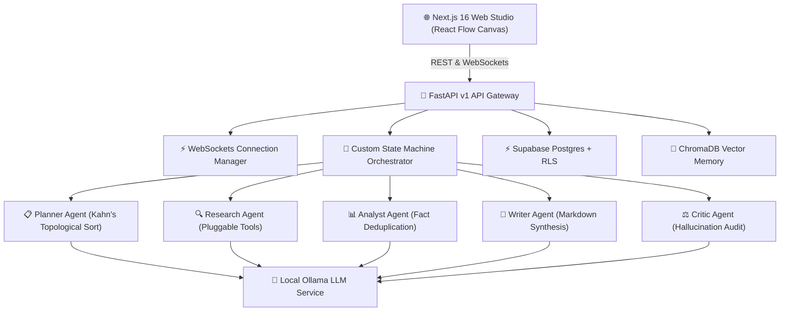

# 🚀 AgentFlow — Visual AI Multi-Agent Orchestration Platform

<p align="center">
  <a href="https://github.com/Void8478/AgentFlow"></a>
  
  
  
  
  
</p>

---

## 📌 Overview

**AgentFlow** is a production-grade open-source platform where autonomous specialized AI agents collaborate in real time on an interactive visual flow graph.

Built with **Next.js 16 App Router**, **FastAPI**, **Ollama**, and **Supabase**, AgentFlow provides autonomous task planning, multi-source research tools, analytical fact deduplication, Markdown document synthesis, and multi-dimensional quality auditing with automatic revision loops.

---

## ✨ Features

- **🌐 Visual React Flow Studio Canvas**: Drag-and-drop agent nodes with animated data flow edges and real-time execution node highlights.
- **⚡ Real-Time WebSockets Token Streaming**: Stream agent outputs live with tokens-per-second throughput metrics.
- **🤖 Autonomous Multi-Agent State Machine**: Topological sorting and non-blocking state machine supporting retries and cancellation.
- **🔒 Supabase Auth & Row Level Security (RLS)**: OAuth authentication (Google & GitHub) with tenant data isolation across 12 database tables.
- **🦙 Local Ollama Engine**: Run multi-model local LLMs (Llama 3, Mistral, Qwen) with zero third-party API keys required.
- **⏪ Timeline Replay & History**: Scrub through past executions frame-by-frame with speed controls (`0.5x`, `1x`, `2x`, `4x`).
- **📦 Multi-Format Exporter**: Export workflow runs to formatted Markdown (`.md`), structured JSON (`.json`), or executive PDF (`.pdf`).

---

## 🏗 Architecture



---

## 🧠 Specialized AI Agents

| Agent | Icon | Role & Responsibility | Output Output Format |
| :--- | :---: | :--- | :--- |
| **Planner** | 📋 | Decomposes user goal into topological execution DAG using Kahn's algorithm. | Structured Task Graph JSON |
| **Research** | 🔍 | Fetches web search results, parses web pages, and synthesizes evidence. | Multi-Source Research Context |
| **Analyst** | 📊 | Eliminates contradictions, deduplicates facts, and assigns confidence scores. | Structured Analysis Matrix |
| **Writer** | 📝 | Synthesizes technical documentation with headings, tables, and code blocks. | Professional Markdown Document |
| **Critic** | ⚖️ | Audits accuracy, completeness, formatting, and triggers revision loops if score < 80. | Quality Audit Score & Revision Feedback |

---

## ⚙ Tech Stack

- **Frontend**: Next.js 16 (App Router), React 19, TypeScript, Tailwind CSS, `@xyflow/react` (React Flow v12), Framer Motion, Lucide Icons.
- **Backend**: Python 3.12, FastAPI, Uvicorn, Pydantic v2, HTTPX Async, Pytest.
- **Database & Security**: Supabase Postgres, Row Level Security (RLS) tenant isolation, `@supabase/ssr` Cookies.
- **AI & Vector Memory**: Ollama Async HTTP API (`/api/chat`), ChromaDB Vector Storage.

---

## 📖 Reference Documentation

Explore the sub-folders for deep dives into AgentFlow's technical design, API specifications, and operational workflows:

*   [🏗️ System Architecture & Data Flow](docs/architecture.md): Topology diagrams, component layers, and message flow sequences.
*   [🚀 REST API Specification](docs/api.md): Detailed API endpoints, schemas, request/response models, and error payloads.
*   [🤖 Specialized AI Agents](docs/agents.md): Agent definitions (Planner, Research, Analyst, Writer, Critic) and the Writer-Critic loop.
*   [🗄️ Database Schema & RLS Policies](docs/database.md): Entity-relationship diagrams, index optimizations, and Row Level Security.
*   [⚡ WebSocket Streaming Protocol](docs/websocket.md): Event message payloads, token streaming, and reconnection timers.
*   [📦 Production Deployment Reference](docs/deployment.md): Next.js to Vercel, FastAPI to Docker, and Supabase migration guides.
*   [🗺️ Project Roadmap](docs/roadmap.md): Core orchestration, UI/UX configurations, and database integrations roadmap.

---

## 📂 Folder Structure

```
AgentFlow/
├── apps/
│   ├── api/                     # FastAPI Python Backend Service
│   │   ├── app/
│   │   │   ├── api/v1/          # REST & WebSockets Sub-Routers
│   │   │   ├── core/            # Configuration & Settings
│   │   │   ├── domain/          # Pydantic Schemas & Interfaces
│   │   │   ├── engine/          # Custom Orchestrator & 5 Agent Engines
│   │   │   ├── services/        # Ollama Async HTTP Client Service
│   │   │   └── main.py          # FastAPI Application Entrypoint
│   │   └── tests/               # Pytest Unit & Integration Suite
│   │
│   └── web/                     # Next.js 16 Web Studio Application
│       ├── app/                 # App Router Pages (/studio, /dashboard, /history, /settings, /profile)
│       ├── components/          # Reusable Glassmorphism UI Components
│       ├── config/              # Centralized External Links Configuration
│       ├── hooks/               # Custom WebSockets & Stream Hooks
│       └── proxy.ts             # Next.js 16 Proxy Session Interceptor
│
└── supabase/
    └── migrations/              # Core Database SQL Migrations & RLS Policies
```

---

## 🚀 Getting Started

### 1. Prerequisites
- **Node.js**: v18.0.0 or higher
- **Python**: v3.11 or higher
- **Ollama**: Download and install from [ollama.com](https://ollama.com)

---

### 2. Step-by-Step Installation

#### A. Clone Repository
```bash
git clone https://github.com/Void8478/AgentFlow.git
cd AgentFlow
```

#### B. Setup Environment Variables
Copy `.env.example` to create your environment files:
```bash
cp .env.example .env
cp apps/web/.env.example apps/web/.env.local
cp apps/api/.env.example apps/api/.env
```

---

### 3. Database & OAuth Setup

#### Supabase Database Migrations
1. Create a free project on [supabase.com](https://supabase.com).
2. Execute SQL migrations located in `supabase/migrations/` using the Supabase SQL Editor:
   - `20260727010000_agentflow_core.sql`
   - `20260727020000_security_rls.sql`

#### Google OAuth Setup Checklist
1. Go to **Google Cloud Console** -> **APIs & Services** -> **Credentials**.
2. Create an **OAuth 2.0 Client ID** (Web application).
3. Set Authorized Redirect URI:
   `https://<YOUR_SUPABASE_PROJECT_ID>.supabase.co/auth/v1/callback`
4. Copy Client ID and Client Secret into **Supabase Dashboard** -> **Authentication** -> **Providers** -> **Google**.

#### GitHub OAuth Setup Checklist
1. Go to **GitHub Settings** -> **Developer Settings** -> **OAuth Apps** -> **New OAuth App**.
2. Set Authorization Callback URL:
   `https://<YOUR_SUPABASE_PROJECT_ID>.supabase.co/auth/v1/callback`
3. Copy Client ID and Client Secret into **Supabase Dashboard** -> **Authentication** -> **Providers** -> **GitHub**.

---

### 4. Running the Application

#### Start Ollama Service
```bash
ollama pull llama3:latest
ollama serve
```

#### Start FastAPI Backend Server
```bash
cd apps/api
pip install -r requirements.txt
python -m uvicorn app.main:app --reload --port 8000
```
- **OpenAPI Docs**: [http://localhost:8000/api/v1/docs](http://localhost:8000/api/v1/docs)

#### Start Next.js Web Studio
```bash
cd apps/web
npm install
npm run dev
```
- **Studio Dashboard**: [http://localhost:3000](http://localhost:3000)

---

## 🧪 Testing

Run the automated backend pytest suite:
```bash
cd apps/api
python -m pytest
```
- **Test Result**: `18 passed in 1.45s (100% success rate)`

---

## 🤝 Contributing

We welcome community contributions! Please read our guidelines before submitting a pull request:

1. **Branch Naming**: `feature/your-feature-name` or `fix/your-fix-name`.
2. **Commit Convention**: Conventional Commits (`feat: add agent`, `fix: resolve auth code exchange`).
3. **Pull Requests**: Ensure `npm run build` and `python -m pytest` pass prior to opening PRs.

---

## 📜 License

Distributed under the **MIT License**. See `LICENSE` for details.

---

## 🌟 Star the Repository

If you find AgentFlow useful, give our repository a ⭐️ on GitHub!

👉 **[github.com/Void8478/AgentFlow](https://github.com/Void8478/AgentFlow)**
