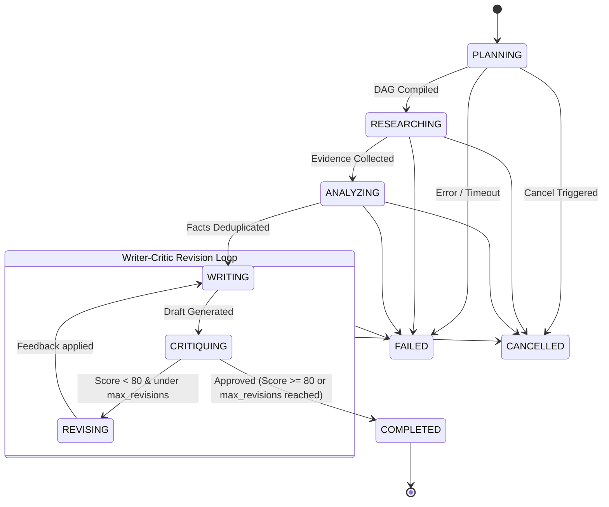

# 🤖 Specialized AI Agents & Collaborative Logic

AgentFlow uses a modular multi-agent architecture. Five distinct specialized agents collaborate to analyze, research, draft, audit, and revise documents.

---

## 👥 The 5 Agent Roles

| Agent | Icon | Role | Key Responsibility |
| :--- | :---: | :--- | :--- |
| **Planner** | 📋 | Task Decomposition | Creates a Directed Acyclic Graph (DAG) using Kahn's topological sort to break down user requests. |
| **Research** | 🔍 | Evidence Acquisition | Runs search queries across web crawlers and scrapes page contents asynchronously. |
| **Analyst** | 📊 | Fact Harmonization | Harmonizes research findings, removes contradictions, and assigns fact confidence scores. |
| **Writer** | 📝 | Markdown Synthesis | Compiles facts into structured, styled Markdown documents with headings and tables. |
| **Critic** | ⚖️ | Quality Assurance | Audits the draft for hallucinated claims, formatting errors, and completeness. |

---

## 🔄 Orchestrator & State Machine Control Loop

The custom workflow state machine drives agent transitions based on the workflow type:
- **`FULL_PIPELINE`**: Executes all 5 agents in sequence: `Planner` ➔ `Research` ➔ `Analyst` ➔ `Writer` ➔ `Critic`.
- **`RESEARCH_ONLY`**: Runs research acquisition and raw data synthesis: `Research` ➔ `Analyst`.
- **`WRITER_CRITIC_ONLY`**: Generates and refines drafts directly from user prompts without searching the web: `Writer` ➔ `Critic`.

---

## 📋 1. Planner Agent
- **Logic**: Reads the user's prompt and identifies dependencies.
- **Output**: Returns a JSON task list sorted in topological order using Kahn's algorithm. This ensures dependent research tasks only run once their prerequisites are met.

---

## 🔍 2. Research Agent
- **Logic**: Takes planned topics and query parameters. It uses pluggable search tool integrations (such as Tavily or Serper) to crawl the web, fetching raw HTML text and returning synthesized snippets.
- **Output**: An structured array of raw findings including source titles, URLs, and text excerpts.

---

## 📊 3. Analyst Agent
- **Logic**: Filters duplicate research claims. It evaluates source validity, removes contradictory statements, and computes a confidence rating (0.00 to 1.00) for each remaining fact.
- **Output**: A deduplicated fact matrix and synthesized key takeaways.

---

## 📝 4. Writer Agent
- **Logic**: Synthesizes the final Markdown document. It integrates facts from the Analyst Agent and applies strict structure rules (e.g., proper header hierarchies, bulleted points, table layouts, and code block formatting).
- **Output**: A draft report in Markdown format.

---

## ⚖️ 5. Critic Agent
- **Logic**: Inspects the drafted document against the initial user request and the analyst's facts. It scores the draft from 0 to 100 based on accuracy, alignment, structure, and readability.
- **Output**: A quality scorecard:
  - If the score is `< 80` and the current revision count is less than `max_revisions`, it generates detailed `revision_instructions` (naming the target section, the identified issue, and the suggested fix) and sets `should_revise` to `true`.
  - If approved, it sets `should_revise` to `false` and terminates the cycle.
