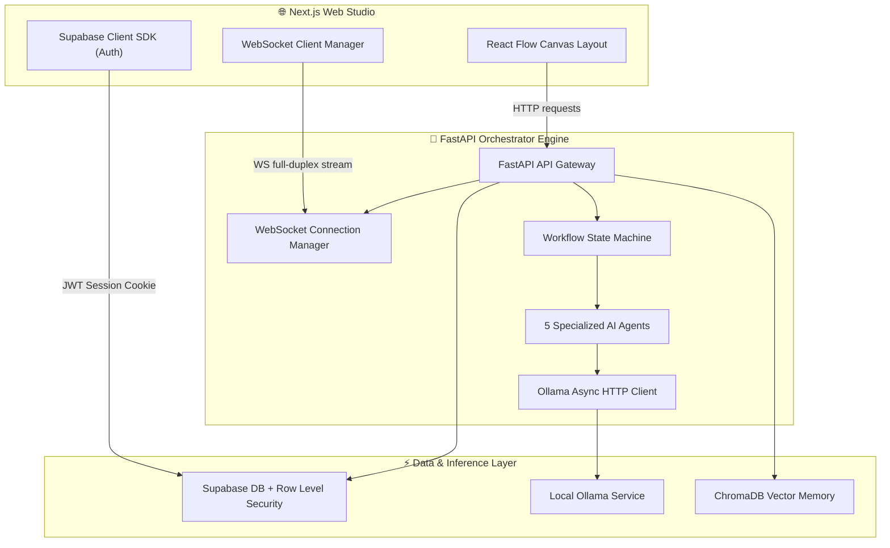

# 🏗️ Architecture Design & System Topology

This document details the system design, communication protocols, and runtime architecture of the **AgentFlow** platform.

---

## 🗺️ System Component Topology

AgentFlow is divided into three primary components:
1. **Next.js Web Studio**: The user interface for configuring flows, initiating agent tasks, streaming token logs, and visualizing execution history.
2. **FastAPI Backend Engine**: An asynchronous Python API layer that acts as the coordinator. It manages WebSockets, hosts the custom state machine orchestrator, and coordinates AI agent jobs.
3. **Upstream Services**: The database infrastructure (Supabase PostgreSQL + RLS), the local inference runtime (Ollama), and the vector memory backend (ChromaDB).

---

## 🔄 Execution Data Flow (Full Pipeline Run)

Below is the chronological sequence of events when a user initiates a full multi-agent pipeline workflow:

```mermaid
sequenceDiagram
    autonumber
    actor User as User Browser
    participant API as FastAPI Backend
    participant WS as WebSocket Server
    participant ORCH as State Machine
    participant Ollama as Ollama / local LLM

    User->>API: POST /api/v1/workflows (Start workflow request)
    API->>ORCH: Initialize WorkflowContext & start async task
    API-->>User: Return workflow_id (wf_xxxx)
    User->>WS: Connect ws://localhost:8000/.../ws/{workflow_id}
    WS-->>User: Accept Connection (status: CONNECTED)
    
    rect rgb(20, 20, 30)
        Note over ORCH, Ollama: Step 1: PLANNING
        ORCH->>Ollama: Generate Topological Task DAG
        Ollama-->>ORCH: Return Task DAG JSON
        ORCH->>WS: Broadcast EVENT: PLANNING_COMPLETE + DAG Payload
        WS-->>User: Stream DAG update (highlight nodes)
    end

    rect rgb(20, 30, 20)
        Note over ORCH, Ollama: Step 2: RESEARCHING
        ORCH->>Ollama: Summarize search queries & parse pages
        Ollama-->>ORCH: Return raw research evidence
        ORCH->>WS: Broadcast EVENT: RESEARCHING_COMPLETE
    end

    rect rgb(30, 20, 20)
        Note over ORCH, Ollama: Step 3: ANALYZING
        ORCH->>Ollama: Merge evidence & deduplicate facts
        Ollama-->>ORCH: Return fact analysis matrix
        ORCH->>WS: Broadcast EVENT: ANALYZING_COMPLETE
    end

    rect rgb(30, 30, 20)
        Note over ORCH, Ollama: Step 4: WRITER-CRITIC LOOP (Revisions)
        loop Revision Loop (up to max_revisions)
            ORCH->>Ollama: Synthesize Markdown document
            Ollama-->>ORCH: Return draft report
            ORCH->>WS: Stream Writer tokens in real-time
            WS-->>User: Token text chunk updates
            ORCH->>Ollama: Critic evaluates draft for accuracy
            Ollama-->>ORCH: Return score & should_revise flag
            alt score < 80 and revision_count < max_revisions
                Note over ORCH: Increment revision_count & repeat
            else score >= 80 or revision_count == max_revisions
                Note over ORCH: Terminate loop
            end
        end
    end

    ORCH->>WS: Broadcast EVENT: COMPLETED (Final markdown payload)
    ORCH->>API: Cache run in history DB
    WS->>User: Close connection
```

---

## 🔒 Security Architecture & RLS

All communication channels and database interfaces are hardened to support safe tenant isolation:

1. **Authentication Interception**: The Next.js frontend handles OAuth redirects (Google/GitHub) via Supabase Auth. A secure server-side proxy middleware intercepts request cookies to refresh and validate user sessions before granting access to protected routes like `/studio` or `/dashboard`.
2. **PostgreSQL Row Level Security (RLS)**: The database tables have RLS enabled. The policies restrict operations based on the active user’s identifier:
   - For configuration settings: `auth.uid() = user_id`.
   - For logs and events: Check if the associated workflow run belongs to the active tenant.
3. **Local Inference Isolation**: By routing LLM operations to Ollama running locally (typically `localhost:11434`), user prompts and generated files never leave the host system, minimizing data leakage risks.
