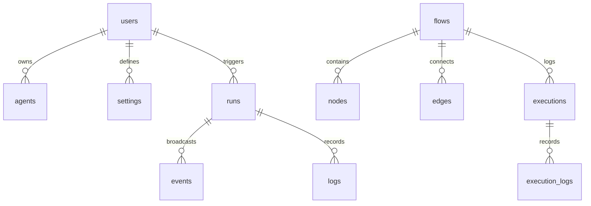

# 🗄️ Database Schema & Security Policies

AgentFlow uses a Supabase-managed PostgreSQL database. It stores users, agents, execution histories, system configurations, and real-time logs under a schema protected by Row Level Security (RLS).

---

## 🗺️ Entity Relationship Overview

The database contains tables organized into two sets: **Core System tables** (users, agents, settings, runs, events, logs) and **Studio Flow Graph tables** (flows, nodes, edges, agent_specs, executions, execution_logs).

---

## 📋 Table Definitions

### 1. `public.users`
Extends Supabase's internal `auth.users` schema.
- `id` (UUID, Primary Key): References `auth.users(id)`.
- `email` (TEXT, NOT NULL).
- `full_name` (TEXT, optional).
- `avatar_url` (TEXT, optional).
- `role` (TEXT, default `'user'`).
- `created_at` / `updated_at` (TIMESTAMPTZ, default `NOW()`).

### 2. `public.agents`
Stores reusable configured AI agent personas.
- `id` (UUID, Primary Key): Default `gen_random_uuid()`.
- `user_id` (UUID, FK): References `public.users(id)`.
- `name` (TEXT, NOT NULL): Persona name.
- `role` (TEXT, NOT NULL): The agent role.
- `description` (TEXT).
- `model` (TEXT, default `'llama3:latest'`).
- `system_prompt` (TEXT).
- `temperature` (NUMERIC, default `0.70`).
- `status` (TEXT, default `'idle'`).
- `is_active` (BOOLEAN, default `true`).

### 3. `public.runs`
Tracks workflow orchestrator executions.
- `id` (UUID, Primary Key): Default `gen_random_uuid()`.
- `user_id` (UUID, FK): References `public.users(id)`.
- `title` (TEXT, NOT NULL).
- `workflow_type` (TEXT, default `'FULL_PIPELINE'`).
- `status` (TEXT, default `'IDLE'`).
- `prompt` (TEXT, NOT NULL).
- `revision_count` (INTEGER, default `0`).
- `max_revisions` (INTEGER, default `3`).
- `result` (JSONB): Contains the finalized Markdown payload.
- `error` (TEXT, optional).
- `started_at` / `completed_at` (TIMESTAMPTZ).

### 4. `public.events`
Telemetry event logging for WebSocket streaming.
- `id` (UUID, Primary Key).
- `run_id` (UUID, FK): References `public.runs(id)`.
- `agent_id` (UUID, FK, optional): References `public.agents(id)`.
- `event_type` (TEXT, NOT NULL).
- `payload` (JSONB, NOT NULL).
- `created_at` (TIMESTAMPTZ).

### 5. `public.settings`
Stores user-specific settings.
- `id` (UUID, Primary Key).
- `user_id` (UUID, FK, UNIQUE): References `public.users(id)`.
- `ollama_host` (TEXT, default `'http://localhost:11434'`).
- `default_model` (TEXT, default `'llama3:latest'`).
- `enable_telemetry` (BOOLEAN, default `true`).
- `theme` (TEXT, default `'dark'`).
- `api_keys` (JSONB): Encrypted third-party API keys (e.g., search tools).

---

## ⚡ Performance Indexes

To support rapid retrieval during streaming UI rendering, the following indexes are configured:
- `idx_agents_user_id` on `public.agents(user_id)`
- `idx_runs_user_id` on `public.runs(user_id)`
- `idx_runs_status` on `public.runs(status)`
- `idx_events_run_id` on `public.events(run_id)`
- `idx_events_created_at` on `public.events(created_at DESC)`
- `idx_logs_run_id` on `public.logs(run_id)`
- `idx_settings_user_id` on `public.settings(user_id)`

---

## 🔒 Row Level Security (RLS) Policies

All database tables have Row Level Security enabled to isolate user data.

| Table | Policy Name | Command | Expression |
| :--- | :--- | :---: | :--- |
| `public.users` | "Users can select their own profile" | `SELECT` | `auth.uid() = id` |
| `public.users` | "Users can update their own profile" | `UPDATE` | `auth.uid() = id` |
| `public.agents` | "Users can manage their own agents" | `ALL` | `auth.uid() = user_id` |
| `public.runs` | "Users can manage their own workflow runs" | `ALL` | `auth.uid() = user_id` |
| `public.events` | "Users can select events for their runs" | `SELECT` | `EXISTS (SELECT 1 FROM public.runs WHERE public.runs.id = run_id AND public.runs.user_id = auth.uid())` |
| `public.settings` | "Users can manage their own settings" | `ALL` | `auth.uid() = user_id` |

*Note: Migrations in `supabase/migrations/20260727020000_security_rls.sql` ensure legacy tables (`flows`, `nodes`, `edges`, `executions`, `execution_logs`) also have RLS enabled, protecting them from unauthorized select or modification queries.*
