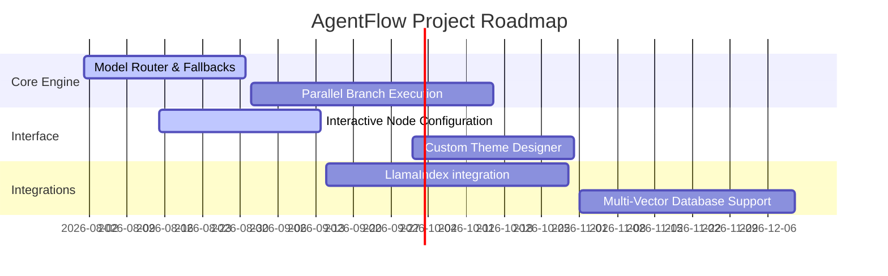

# 🗺️ Project Roadmap & Future Scope

This roadmap outlines planned improvements for **AgentFlow** across orchestrations, user interface features, integrations, and deployment patterns.

---

## 📅 Roadmap Overview

---

## ⚡ 1. Core Orchestration Engine

- **Model Router & Fallbacks**: Enable automatic router fallbacks. If the local Ollama Llama3 service times out or hits an out-of-memory error, the engine routes requests to alternate local runtimes (e.g. Qwen or Mistral).
- **Parallel Branch Execution**: Update the custom orchestrator state machine to support executing independent DAG branches concurrently.
- **Enhanced Replay Scrubbing**: Allow users to alter prompts or system settings directly inside the timeline replay view at a specific step and resume execution from that point.

---

## 🎨 2. User Interface & Visual Studio

- **Interactive Node Configuration**: Allow users to click on any React Flow canvas node to edit its model, system prompt, temperature, and specific tool parameters dynamically before execution.
- **Custom Theme Designer**: Build styling controls inside the dashboard for user preference customization (e.g., custom colors and canvas node styles).
- **Expanded Flow Templates**: Introduce pre-configured flow templates for common use cases (e.g., competitive analysis, code refactoring audits, and data extraction).

---

## 🔌 3. Memory & Tool Integrations

- **Multi-Vector Database Support**: Introduce pluggable support for alternate vector databases (e.g. Milvus, Pinecone, or pgvector) alongside ChromaDB.
- **LlamaIndex Integration**: Integrate LlamaIndex for advanced Retrieval-Augmented Generation (RAG) capabilities over local file uploads.
- **Agent Sandbox Execution**: Sandbox code execution for tools using Docker container environments.
